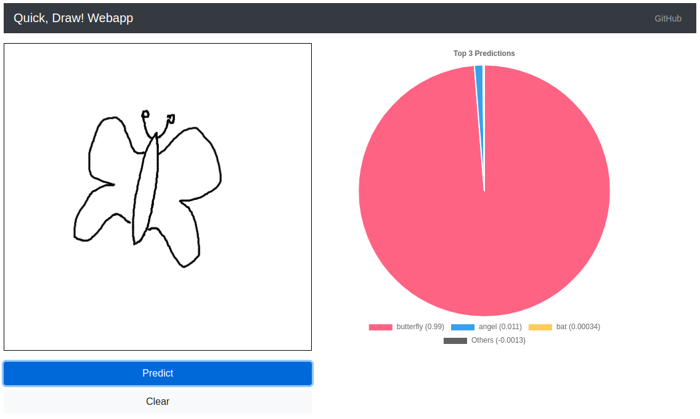

# quickdraw-cnn

A convolutional neural network using Tensorflow and Google's Quick, Draw! [dataset](https://github.com/googlecreativelab/quickdraw-dataset) to recognize hand drawn images including a webapp to draw them.

Read my [blog post](https://larswaechter.dev/blog/recognizing-hand-drawn-doodles/) for more information. You can find a webapp demo [here](https://quickdraw-cnn.fly.dev/).



## Setup

### cnn

Switch to the `cnn` directory, create a new virtual environment and install the required packages:

```
python -m venv ./venv
source ./venv/bin/activate
pip install -r requirements.txt
```

Then, launch Jupyter in the target directory:

```
jupyter notebook
```

### webapp

#### Native

Switch to the `webapp` directory, create another venv and install the requirements as mentioned above. You can run the webapp using the following command:

```
uvicorn main:app
```

The webapp should be available at [http://127.0.0.1:8000](http://127.0.0.1:8000).

#### Docker

Alternatively, you can also run it via Docker:

```
docker build . -t quickdraw-webapp
docker run -p 443:443 quickdraw-webapp
```

The webapp should be available at [http://0.0.0.0:443](http://0.0.0.0:443).
